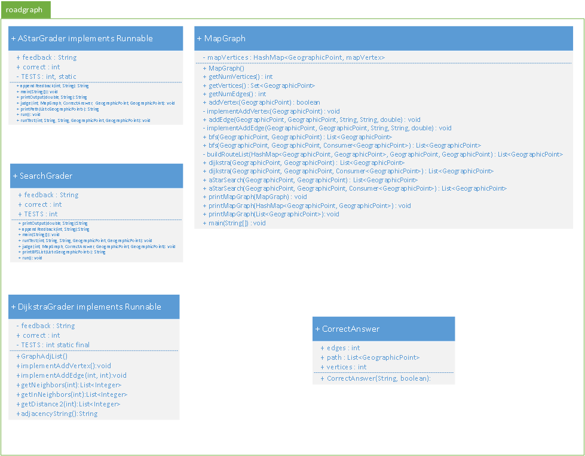

\fontsize{10}{12}

## Executive Summary
Work is summarized that demonstrates Class Design, an Abstract Data Type (ADT), and Breadth First Search (BFS). A java code template is provided by UC San Diego faculty. The skeleton code is comprised of 262 files in 51 directories. Development excutes with Java JDK 1.8.0_60-b27 in an Eclipse Version: Mars.1 Release (4.5.1) environment. Version control executes with git version 1.9.5.msygit.0. After BFS successfully implemented, the code is 269 files with 51 directories. Code development includes the addition of nine methods in a provided java class (MapGraph.java) and two additional classes with an additional combined count of twenty-two methods.

## Project Summary
The project delivers (1) geographic routing between geographic start and destination locations and (2) visualization of the graph nodes visited during BFS. The code demonstrates class design that implements two constructs: (1) ADT and (2) BFS.  The ADT is a graph that stores data using a [HashMap](http://docs.oracle.com/javase/8/docs/api/java/util/HashMap.html). Geographic location data is stored in an object that is named GeographicPoint (GP) and that extends the [Object.Number.Double](http://docs.oracle.com/javase/7/docs/api/java/lang/Double.html) class. Data are visualized using the [Google Map API](https://www.google.com/work/mapsearth/products/mapsapi.html).

## Introduction
A graph is a construction that contains nodes and edges. Nodes are objects that contain data, and edges represent connections between nodes.  In the context of geographic map data, a GP represents a node and roads represent edges connecting these nodes. Developed code is in ```MapGraph.java``` class of the ```roadgraph``` package. Figure 1 shows an UML diagram for the ```roadgraph``` package.


**Figure 1**: Figure 1 shows an UML class diagram for the ```roadgraph``` package, which includes the class ```MapGraph.java```.

**Figure 2** shows an UML object diagram representing the nodes and edges of the graph ADT. Classes and methods added to the skeleton code are contained in MapGraph.java class and are described in the **Methods** section. Two classes introduced to represent nodes (mapVertex()) and edges (mapEdge()) that are pictured in **Figure 2** are described in the **Methods** section.


**Figure 2**: Figure 2 shows an UML object diagram for the ```roadgraph``` package that depicts the mapVertex() and mapEdge() methods. More detailed description of these two methods is in the **Methods** section


## Methods

The pseudocode for BFS is:
```
bfs(start, destination, Consumer<GP>):
Initialization of structures
Enqueue GP in queue and add to list of visited GP's
while queue is not empty:
    dequeue GP from front of queue as current
    if current == destination, then return parent map
    for each of current's unvisited neighbors, n:
        add n to visited set
        add current as n's parent in parent map
        enqueue n to back of queue
if parent map not returned, then there is no path
```
Consumer\<GP\> is a hook that passes nodes visited during BFS search to the class that provides a visual representation of the visited nodes.

### Class: MapGraph
BFS is implemented in the class MapGraph.java, for which some skeleton code is provided. Modifications made to MapGraph included:

+ **MapGraph()** is modified to an empty contructor that instantiates a HashMap for the ADT of this Java application. The HashMap object stores a GP as a key with a list of mapVertex() objects for its value. Definition of mapVertex() is deferred.
+ **getNumVertices() : int** is modified to return the number of vertices contained within an instantiated MapGraph(). The return value is used for debug and test.
+ **getVertices() : Set\<GeographicPoint\>** is modified to return the key set of the ADT HashMap. Membership in the key set is used as a conditional in BFS.
+ **getNumEdges() : int** is modified to return the number of edges that connect each GP. The return value is used for debug and test.
+ **addVertex(GeographicPoint) : boolean**  is modified to determine whether a proposed GP satisfies a specification and, if true, then calls the method implementAddVertex().
+ **implementAddVertex(GeographicPoint) : void** is a **new method** that adds the GP to the MapGraph/HashMap key set. This method calls mapVertex(); description deferred.
+ **addEdge(GeographicPoint, GeographicPoint, String, String, double) : void** is modified to determine whether a proposed edge satisfies specification and, if true, then calls the method implementAddVertex().
+ **implementAddEdge(GeographicPoint, GeographicPoint, String, String, double) : void** is a **new method** that adds the edge to the MapGraph/HashMap. This method calls setters/getters in mapEdge().
+ **bfs(GeographicPoint, GeographicPoint) : List\<GeographicPoint\>** is unmodified. This method is used for testing BFS in the console.
+ **bfs(GeographicPoint, GeographicPoint, Consumer\<GeographicPoint\>) : List\<GeographicPoint\>** is modified to implement BFS. The method validates whether the the profided GP's are valid and, if true, then returns a list of GP's in reverse order that connect the start and destination GP's.
+ **buildRouteList(HashMap\<GeographicPoint, GeographicPoint\>, GeographicPoint, GeographicPoint) : List\<GeographicPoint\>** is a **new method** that returns the route in *travel-order* from start GP to destination GP.
+ **dijkstra(GeographicPoint, GeographicPoint) : List\<GeographicPoint\>** is unmodified. This method is used for testing Dikstra search in the console.
+ **dijkstra(GeographicPoint, GeographicPoint, Consumer\<GeographicPoint\>) : List\<GeographicPoint\>** is not modified and not implemented.
+ **aStarSearch(GeographicPoint, GeographicPoint) : List\<GeographicPoint\>** is unmodified. This method is used for testing a* search in the console.
+ **aStarSearch(GeographicPoint, GeographicPoint, Consumer\<GeographicPoint\>) : List\<GeographicPoint\>** is not modified and not implemented.
+ **printMapGraph(MapGraph) : void** is a **new overloaded method** that prints out the MapGraph()/HashMap() ADT for debug and test.
+ **printMapGraph(HashMap\<GeographicPoint, GeographicPoint\>) : void** is a **new overloaded method** that prints out the reverse order list of GP's that were visited during BFS.
+ **genPoint(double, double) : GeographicPoint** is a new method implemented for generating GP's that are used for debug and test, e.g. generating GP's that are not contained in MapGraph()/HashMap() for *edge-case* testing.
+ **main(String[]) : void** is a method modified to test operations of MapGraph.java class within the console.
+ **mapVertex** is a **new class generated** for data storage and is described in its own Section.
+ **mapEdge** is a **new class generated** for data storage and is described in its own Section.
 
### Class name: mapVertex

The class mapVertex is a node that represents a GP.  The mapVertex node also contains a list of mapEdge()'s that represent roads that connect a GP to other GP's in the MapGraph(). Data are private, so five getter/setter methods are used to pass data to and from a mapVertex() instance. Figure 2 lists the setter/getter methods.

### Class name: mapEdge
The class mapEdge is a graph edge that represents roads connecting GP's. The graph is a di-Graph; therefore, an instance of mapEdge() contains a start node and an end node.  The mapEdge object also contains other geographic data: street name, distance between the start and end GP's, and type of road. Data are private, so ten getter/setter methods pass data to and from a mapEdge() instance. Figure 2 lists the setter/getter methods.

### Class Design: Overall Design Justification
The class design partitions formation of the ADT (HashMap mapGraph(), mapVertex(), and mapEdge()) into separate methods. Where possible, variables and methods are defined as ```private```. This provides an abstraction layer between user and data. The BFS method also is comprised of two methods--bfs() and buildRouteList(). The bfs() executes the BFS and returns an intermediary list of routing nodes. The buildRouteList() transforms the intermediary list of routing nodes to the final list of nodes of the route in travel-order. Modularity provides robustness and flexibility. For example, implementing altnerate search algorithms only requires the addition of code blocks that implement only the search algorithm. The ADT is unaffected by incorporating additional search algorithms.

## Results
Figure 3 shows the deliverable--a route between two geographic locations.


**Figure 3**: Figure 3 shows a route generated using BFS between geographic locations on the campus of [Brandeis University](https://www.brandeis.edu) (Waltham, MA).

A [video clip](https://youtu.be/jvZqHP5YdI8) demonstrates execution of the project. The clip shows a route between start and destionation GP's and provides a visualization of GP's visited during BFS. The clip also includes a cartoon of BFS generated using a [visualization tool](http://qiao.github.io/PathFinding.js/visual/) made available by [Xueqiao (Joe) Xu](https://github.com/qiao).  The cartoon is drawn representing the Google map in the clip. The MapGraph.java file is available on request by contacting the corresponding author.

## Conclusions
Class design, an ADT, and BFS were successfully implemented and demonstrated as a Java application that provides routing between two geographic locations using the Google Maps API. The implemented class design provides flexibility, modularity, and robustness.  For example, different search algorithms can be implemented with the existing ADT and only modest changes to the ```roadgraph``` package.


## Acknowledgements
The author gratefully acknowledges the pedagogy of C Alvarado, M Minnes, and L Porter. This report is generated via [OpenSource](http://opensource.org/) using [MarkDown](http://daringfireball.net/projects/markdown/) and [R](https://cran.r-project.org/) x64 3.1.2 within [RStudio](https://www.rstudio.com/) Version 0.98.1102 environment.

## References

1. [Java Documentation](https://docs.oracle.com/javase/8/docs/api/overview-summary.html)
2. [Stack Overflow](https://stackoverflow.com/)

